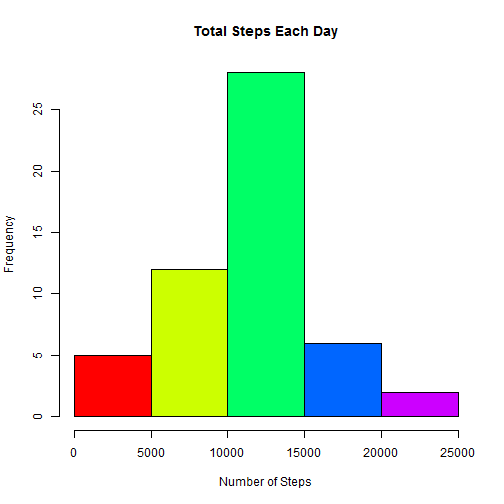
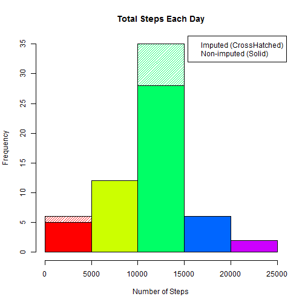

#Assignment Description
## Introduction
It is now possible to collect a large amount of data about personal movement
using activity monitoring devices such as a Fitbit, Nike Fuelband, or Jawbone
Up. These type of devices are part of the "quantified self" movement - a group
of enthusiasts who take measurements about themselves regularly to improve
their health, to find patterns in their behavior, or because they are tech geeks.
But these data remain under-utilized both because the raw data are hard to
obtain and there is a lack of statistical methods and software for processing and
interpreting the data.

This assignment makes use of data from a personal activity monitoring device.
This device collects data at 5 minute intervals through out the day. The data
consists of two months of data from an anonymous individual collected during
the months of October and November, 2012 and include the number of steps
taken in 5 minute intervals each day.

**Note: Plots in the Assignment Description are removed as not to be confused with the actual results in the <a href="#work">Assignment Work</a> below.**

### Data

The data for this assignment can be downloaded from the course web site:

Dataset: [Activity monitoring data][2] [Size: 52K]
         
[2]: https://d396qusza40orc.cloudfront.net/repdata%2Fdata%2Factivity.zip "Activity monitoring data"

The variables included in this dataset are:

Variable | Description
-------- | -----------
steps    | Number of steps taking in a 5-minute interval (missing values are coded as NA)
date     | The date on which the measurement was taken in YYYY-MM-DD format
interval | Identifier for the 5-minute interval in which measurement was taken

The dataset is stored in a comma-separated-value (CSV) file and there are a
total of 17,568 observations in this dataset.

### Assignment

This assignment will be described in multiple parts. You will need to write a
report that answers the questions detailed below. Ultimately, you will need to
complete the entire assignment in a single R markdown document that can
be processed by knitr and be transformed into an HTML file.

Throughout your rep ort make sure you always include the co de that you used to
generate the output you present. When writing code chunks in the R markdown
document, always use echo = TRUE so that someone else will be able to read
the code. This assignment will be evaluated via peer assessment so it
is essential that your peer evaluators be able to review the code for
your analysis.

For the plotting aspects of this assignment, feel free to use any plotting system
in R (i.e., base, lattice, ggplot2)

Fork/clone the GitHub repository created for this assignment. You will submit
this assignment by pushing your completed files into your forked repository on
GitHub. The assignment submission will consist of the URL to your GitHub
repository and the SHA-1 commit ID for your repository state.

NOTE: The GitHub repository also contains the dataset for the assignment so
you do not have to download the data separately.

#### Loading and preprocessing the data
Show any code that is needed to

1. Load the data (i.e. read.csv() )
2. Process/transform the data (if necessary) into a format suitable for your analysis

#### What is mean total number of steps taken per day?
For this part of the assignment, you can ignore the missing values in the dataset.

1. Make a histogram of the total number of steps taken each day
2. Calculate and report the mean and median total number of steps taken per day

#### What is the average daily activity pattern?

1. Make a time series plot (i.e. **type = "l"**) of the 5-minute interval (x-axis) and the average number of steps taken, averaged across all days (y-axis)
2. Which 5-minute interval, on average across all the days in the dataset, contains the maximum number of steps?

#### Imputing missing values
Note that there are a number of days/intervals where there are missing values (coded as **NA**). The presence of missing days may introduce bias into some calculations or summaries of the data.

1. Calculate and report the total number of missing values in the dataset (i.e. the total number of rows with NAs)
2. Devise a strategy for filling in all of the missing values in the dataset. The strategy does not need to be sophisticated. For example, you could use the mean/median for that day, or the mean for that 5-minute interval, etc.
3. Create a new dataset that is equal to the original dataset but with the missing data filled in.
4. Make a histogram of the total number of steps taken each day and Calculate and report the mean and median total number of steps taken per day. Do these values differ from the estimates from the first part of the assignment? What is the impact of imputing missing data on the estimates of the total daily number of steps?

#### Are there differences in activity patterns between weekdays and weekends?

For this part the weekdays() function may be of some help here. Use the dataset
with the filled-in missing values for this part.
1. Create a new factor variable in the dataset with two levels - "weekday"
and "weekend" indicating whether a given date is a weekday or weekend
day.
2. Make a panel plot containing a time series plot (i.e. type = "l") of the
5-minute interval (x-axis) and the average number of steps taken, averaged
across all weekday days or weekend days (y-axis). The plot should look
something like the following, which was creating using simulated data:

#### Your plot will look different from the one above because you will be using the activity monitor data.
Note that the above plot was made using the lattice
system but you can make the same version of the plot using any plotting system
you choose

***

<a name="work"></a> 

# Assignment Work by student

### Loading and preprocessing the data

The loading and preprocessing section performs the following functions:

1. Loads required Libraries, Sets up the working directory and program variables.
2. Check to see if the dataset is present


```r
library(lattice)

workdir  <- "C:/Data/"
arcfile  <- "repdata%2Fdata%2Factivity.zip"
datafile <- "activity.csv"
weekdays <- c("Monday", "Tuesday", "Wednesday", "Thursday", "Friday")

setwd (workdir)

if(!file.exists( arcfile )) {
    print ("Dataset not found - attempting download from source")
    ds_srce = "https://d396qusza40orc.cloudfront.net/repdata%2Fdata%2Factivity.zip"
    download.file(ds_srce, arcfile)
    unzip(arcfile)
}

data <- read.csv("activity.csv")
```

### What is mean total number of steps taken per day?

1. Make a histogram of the total number of steps taken each day

```r
steps_by_day <- aggregate(steps ~ date, data, sum)
hist(steps_by_day$steps, main = paste("Total Steps Each Day"),
     col=rainbow(5), xlab="Number of Steps")
```

 

2. Calculate and report the mean and median total number of steps taken per day

```r
step_mean   <- mean(steps_by_day$steps)
step_median <- median(steps_by_day$steps)
```

Current Values:

```
## step_mean  : 10766.19 
## step_median:  10765
```

### What is the average daily activity pattern?

1. Make a time series plot (i.e. **type = "l"**) of the 5-minute interval (x-axis) and the average number of steps taken, averaged across all days (y-axis)

```r
steps_by_interval <- aggregate(steps ~ interval, data, mean)

plot(steps_by_interval$interval,steps_by_interval$steps, type="l", 
     xlab="Interval", ylab="Number of Steps",
     main="Average Number of Steps per Day by Interval")
```

 

2. Which 5-minute interval, on average across all the days in the dataset, contains the maximum number of steps?

```r
max_interval <- steps_by_interval[which.max(steps_by_interval$steps),1]
```

Period with the highest # of steps:

```
## max_interval:  835
```

### Imputing missing values
Note that there are a number of days/intervals where there are missing values (coded as **NA**). The presence of missing days may introduce bias into some calculations or summaries of the data.

1. Calculate and report the total number of missing values in the dataset (i.e. the total number of rows with NAs)

```r
incomplete <- sum(!complete.cases(data))
imputed_data <- transform(data, steps = ifelse(is.na(data$steps), 
                          steps_by_interval$steps[match(data$interval,
                          steps_by_interval$interval)], data$steps))
```

2. Devise a strategy for filling in all of the missing values in the dataset. The strategy does not need to be sophisticated. <br/> I am using the data from the first date of the dataset.

```r
imputed_data[as.character(imputed_data$date) == "2012-10-01", 1] <- 0
```

3. Create a new dataset that is equal to the original dataset but with the missing data filled in.

```r
imputed_steps_by_day <- aggregate(steps ~ date, imputed_data, sum)
```

4. Make a histogram of the total number of steps taken each day.

```r
hist(imputed_steps_by_day$steps, main = paste("Total Steps Each Day"), 
     density=25, angle = 45, col=rainbow(5), border = "black",
     xlab="Number of Steps")         # Imputed Values

hist(steps_by_day$steps, main = paste("Total Steps Each Day"), col=rainbow(5), 
     xlab="Number of Steps", add=T)  # Non- Imputed Values

legend("topright", c("Imputed (CrossHatched)", "Non-imputed (Solid)"))
```

 

5. Calculate and report the mean and median total number of steps taken per day. 

```r
imputed_rmean   <- mean(imputed_steps_by_day$steps)
imputed_rmedian <- median(imputed_steps_by_day$steps)

mean_diff <- imputed_rmean   - step_mean
med_diff  <- imputed_rmedian - step_median

total_diff <- sum(imputed_steps_by_day$steps) - sum(steps_by_day$steps)
```

These values are as follows:

```
## imputed_rmean: 10589.69 
## imputed_rmedian: 10766.19 
## mean_diff: -176.4949 
## med_diff: 1.188679 
## total_diff: 75363.32
```

### Are there differences in activity patterns between weekdays and weekends?

1. Create a new factor variable in the dataset with two levels - "weekday" and "weekend" indicating whether a given date is a weekday or weekend day.

```r
imputed_data$dow = as.factor(ifelse(is.element(weekdays(as.Date(imputed_data$date)),
                                               weekdays), "Weekday", "Weekend"))

steps_by_interval_i <- aggregate(steps ~ interval + dow, imputed_data, mean)
```

2. Make a panel plot containing a time series plot (i.e. type = "l") of the 5-minute interval (x-axis) and the average number of steps taken, averaged across all weekday days or weekend days (y-axis). 

```r
xyplot(steps_by_interval_i$steps ~ steps_by_interval_i$interval|steps_by_interval_i$dow,
       main="Average Steps per Day by Interval",xlab="Interval", ylab="Steps",
       layout=c(1,2), type="l")
```

 
